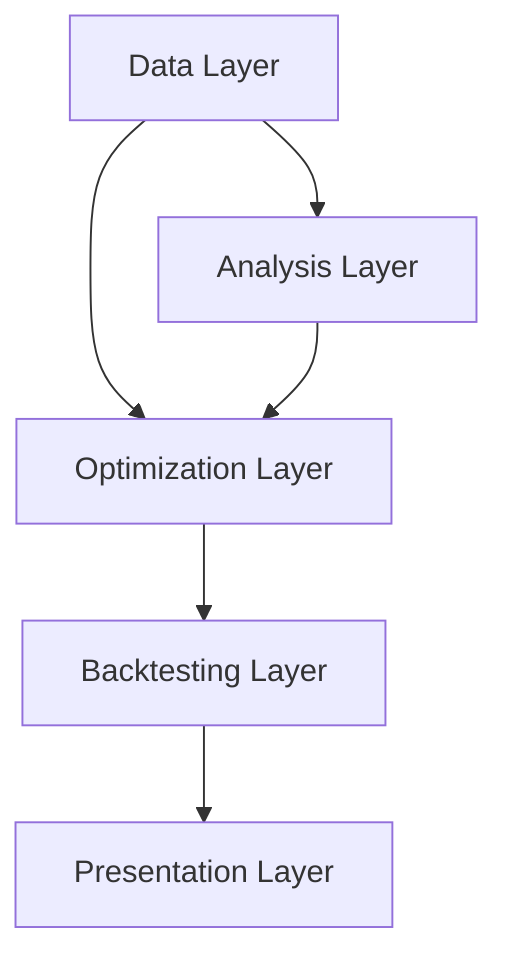

# Project Architecture

## Overview
The system has been refactored into a **modular, layered architecture** designed for scalability and extensibility.

## Module Breakdown

### 1. Optimization Layer (`portfolio/optimization/`)
*Design Pattern: Strategy*
- **`base.py`**: Defines the `OptimizationStrategy` interface.
- **`mean_variance.py`**: Standard convex optimization (MinVar, IVP).
- **`risk_parity.py`**: Risk budgeting (ERC) and clustering (HRP).
- **`advanced.py`**: Complex models (Mean-CVaR, Black-Litterman).

### 2. Backtesting Layer (`portfolio/backtesting/`)
*Design Pattern: Template Method*
- **`engine.py`**: `BacktestEngine` defines the simulation skeleton (PnL, rebalancing loops).
- **`strategies.py`**: Concrete implementations (`LongOnlyBacktester`) override specific logic.
- **`utils.py`**: Shared utilities for calendar management and math.

### 3. Analysis Layer (`analysis/`)
- **`volatility.py`**: GARCH models for dynamic risk forecasting.
- **`factors.py`**: Fama-French factor regressions.
- **`ml_models.py`**: Machine Learning for alpha generation.

### 4. Data Layer (`data/`)
- **`stock_data_fetcher.py`**: Unified gateway for Yahoo Finance and FRED data. Supports real-time streaming generators.

### 5. Presentation Layer (`reporting/`)
- **`dashboard.py`**: Streamlit-based web application for user interaction.
- **`visualizer.py`**: Plotly-based charting engine.

## DevOps & Infrastructure
- **Docker**: Containerized environment ensuring reproducibility.
- **GitHub Actions**: CI pipeline running unit tests on every push.