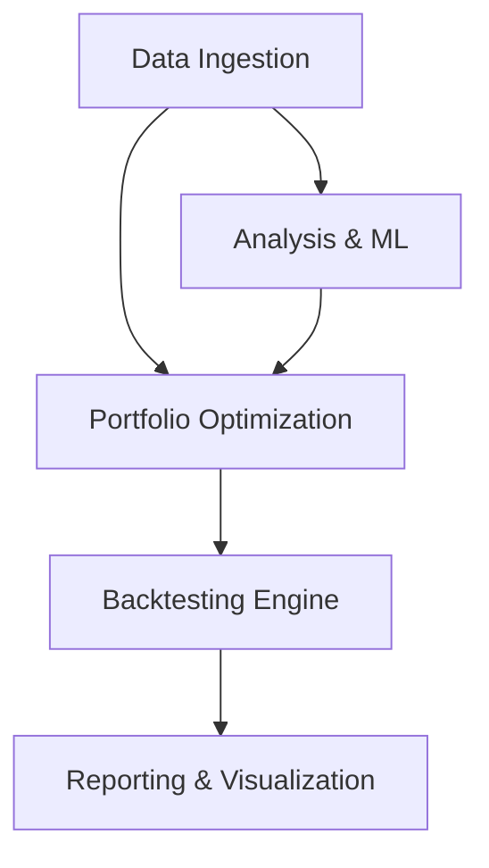

# Project Architecture

## Overview
The system follows a modular pipeline architecture, processing data from ingestion to visualization.

## Core Modules

### 1. Data Layer (`data/`)
- **`MarketDataFetcher`**: Unified interface for Yahoo Finance (Prices) and FRED (Economic Data).
- **Streaming**: Supports generator-based real-time price feeds.

### 2. Analytics Layer (`analysis/`)
- **Feature Engineering**: Calculates rolling volatility, momentum, and trends.
- **Factor Models**: Decomposes returns into market, size, and value factors.
- **Regime Detection**: Uses Hidden Markov Models to classify market states.

### 3. Optimization Layer (`portfolio/construction.py`)
- **Mean-CVaR**: Convex optimization for tail risk.
- **Black-Litterman**: Bayesian approach to combining views with priors.
- **HRP**: Machine Learning (Clustering) approach to allocation.

### 4. Simulation Layer (`portfolio/backtesting.py`, `portfolio/execution.py`)
- **Backtester**: Event-driven simulation with rebalancing logic.
- **Execution Simulator**: Models market impact and slippage based on volume.

### 5. Presentation Layer (`reporting/`)
- **Streamlit Dashboard**: Interactive UI for user control.
- **Plotly**: Engine for dynamic charts.

## Technology Stack
- **Python 3.8+**
- **Data**: Pandas, Numpy, yfinance, fredapi
- **Optimization**: CVXPY, Scipy
- **ML/Stats**: Scikit-Learn, Statsmodels
- **UI**: Streamlit, Plotly
